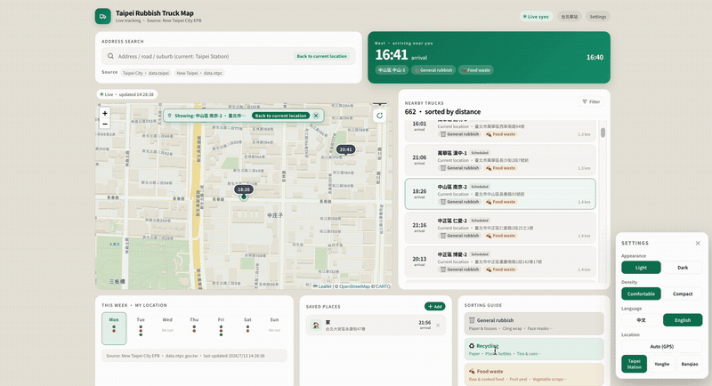

# Taipei Rubbish Truck Map (tw-truck-map)

A dual-city rubbish truck map combining public data from **New Taipei City** (live GPS) and **Taipei City** (schedules). Users can see nearby trucks running in real time, estimated arrival times, collection types, and the next truck near their saved places.

Desktop and mobile have independent layouts (it automatically switches to the desktop dashboard at 1200px and above).



## Data sources

| City | API | Content | CORS |
|------|-----|---------|------|
| New Taipei | `data.ntpc.gov.tw` | Live truck GPS + route stops | Not allowed |
| Taipei | `data.taipei` | Route schedules (per-stop arrival/departure times), no live GPS | Not allowed |
| Address lookup | `nominatim.openstreetmap.org` | Reverse + forward geocoding | User-Agent restricted |

CORS in the dev environment is handled by the proxy in [vite.config.js](vite.config.js) (`/api/ntpc`, `/api/taipei`, `/api/geocode`). **A production deployment needs its own backend with the same rewrite rules**, otherwise the browser will block requests due to CORS.

## Development

```bash
npm install
npm run dev      # http://localhost:5173
npm run build    # outputs to dist/
npm run preview  # preview the production build
npm run lint
```

Requires Node 18+. The first dev startup fetches 4000+ schedule records from `data.taipei` (~6s); this is cached in localStorage with stale-while-revalidate (1 hour hard TTL).

## Key features

- **Map** — Leaflet + CartoDB base tiles (Voyager / Dark_All dual themes), auto-fits bounds to frame the user's location together with the nearest 20 trucks.
- **Nearby trucks list** — sorted by distance; tap any truck → the map focuses and zooms in on it (zoom 17).
- **Filter (FilterPopover)** — "All / Live New Taipei / Scheduled Taipei" + waste-type toggles; shared by desktop and mobile.
- **Address search** — fuzzy match over deduplicated names from the 4000+ stops (including district/village); on selection the map recenters on that address and re-sorts trucks.
- **Saved places** — persisted in localStorage, shows the next truck nearest to each place.
- **Tooltip** — a hover tooltip portalled to `document.body`, ideal for showing full text inside `overflow:hidden` containers.
- **This week's collection days / sorting guide** — static content, defined in [src/data/staticData.js](src/data/staticData.js).
- **Dark mode + density toggle** — via the settings panel.
- **Language toggle** — English / Traditional Chinese, via the settings panel; defaults to English (see [src/i18n.jsx](src/i18n.jsx)).

## Architecture

```
src/
├── App.jsx                     Main entry; manages data fetch / GPS / focusedLocation / truckFilter,
│                                switches between desktop (DesktopDashboard) and mobile
│                                (TabBar + MapScreen ...) by viewport width.
├── components/
│   ├── desktop-dashboard.jsx   Desktop dashboard (map + nearby list + saved + guide + weekly calendar)
│   ├── map-screen.jsx          Mobile map page (full-bleed map + bottom BottomSheet)
│   ├── map-gl.jsx              Leaflet wrapper, truckDivIcon / FitBoundsOnChange / zoom control
│   ├── ios-frame.jsx           iOS frame shell for the mobile layout
│   ├── other-screens.jsx       Mobile tabs (Times / Search / Saved / Guide)
│   ├── shared.jsx              Shared UI (theme, Icon, WasteChip, FilterPopover, Tooltip, TabBar)
│   └── AddFavoriteModal.jsx    Add-saved-place dialog (with forward-geocoding confirmation)
└── data/
    ├── DataContext.jsx         React context wrapper
    ├── taipei.js               Dual-city data fetch / merge / distance calc / filter helper
    ├── staticData.js           Waste-type colour tokens, default locations, weekly calendar, sorting guide
    └── useFavorites.js         Saved-places hook (localStorage)
```

### Data flow

1. `App.jsx` gets GPS → `fetchTaipeiData(userLocation)` → processes and stores into `data` state.
2. Fetches NTPC live trucks + Taipei schedules in parallel, merges them, and sorts by distance.
3. NTPC stops (3.4MB) are lazy-loaded only the first time search is opened, then merged into the existing cache.
4. `focusedLocation` (tapping a saved place / search dropdown / a truck) makes the map re-fit bounds or `setView` to a given zoom.
5. `truckFilter` (`{ source, types }`) is applied on both the list and map sides via `applyTruckFilter()`.

### Tooltip component

The `<Tooltip>` in [shared.jsx](src/components/shared.jsx):

```jsx
<Tooltip content="Full text" dark={dark} side="bottom" delay={150}>
  <span style={{ overflow: 'hidden', textOverflow: 'ellipsis', whiteSpace: 'nowrap' }}>
    Truncated text
  </span>
</Tooltip>
```

Characteristics:
- Uses `createPortal` to float to `document.body`, escaping any ancestor's `overflow: hidden`.
- `Children.only` + `cloneElement` wires events onto the trigger without adding a wrapper, so it doesn't break flex layout.
- Built-in 150ms hover delay (avoids flicker when quickly moving across it); recalculates coordinates on scroll/resize.
- `role="tooltip"` + dynamic `aria-describedby`, screen-reader friendly.

## Known limitations

- `inferAccepts()` currently returns `['general', 'food']` for every truck — so the "waste type" filter mainly differs by how many are checked/unchecked. Finer distinctions would need to be derived from the API separately (e.g. number plate or route name).
- A production deployment without a backend proxy will be blocked by CORS; currently only usable in the dev environment.
- Nominatim has a [usage policy](https://operations.osmfoundation.org/policies/nominatim/) (1 req/sec + required User-Agent); rate-limit yourself when searching frequently.
```